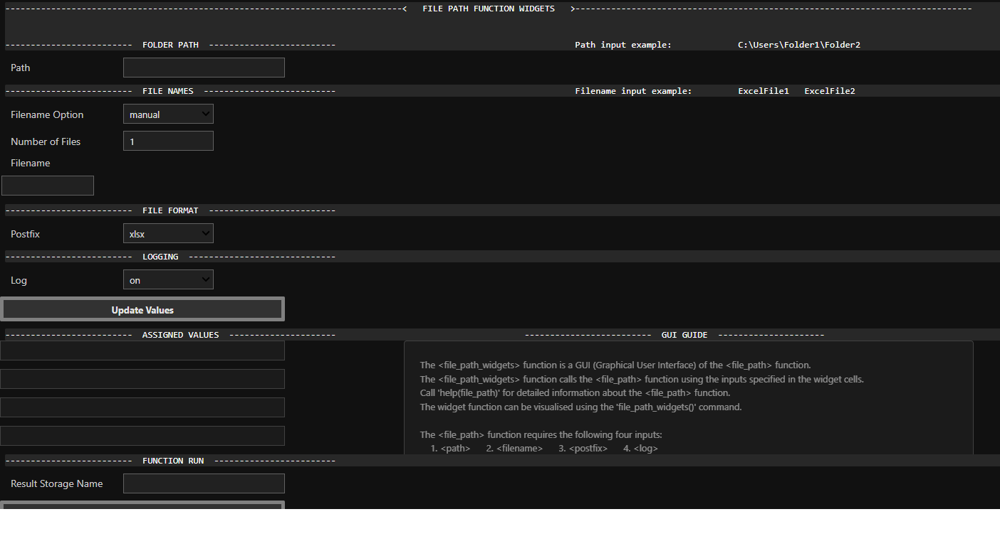
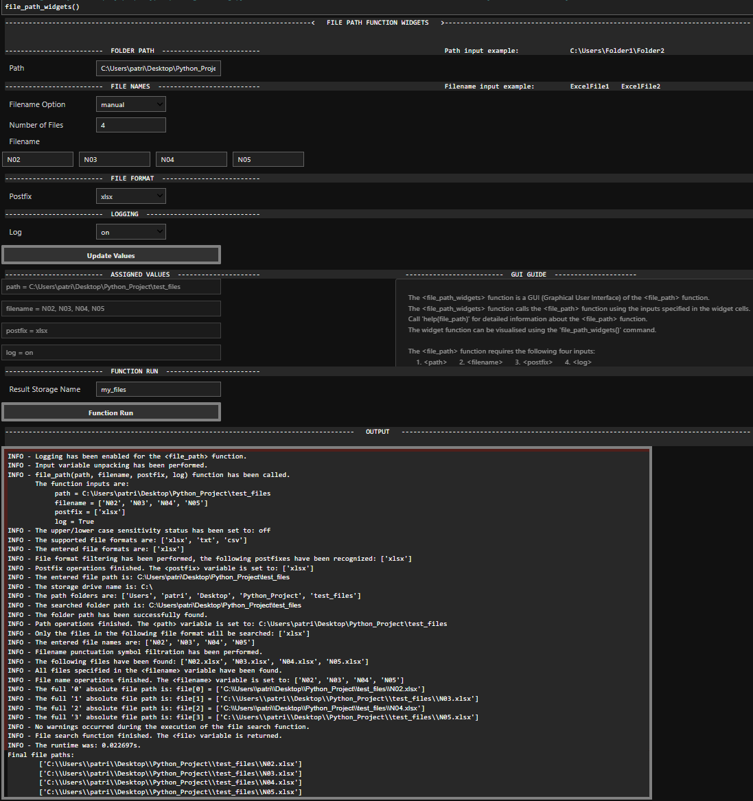
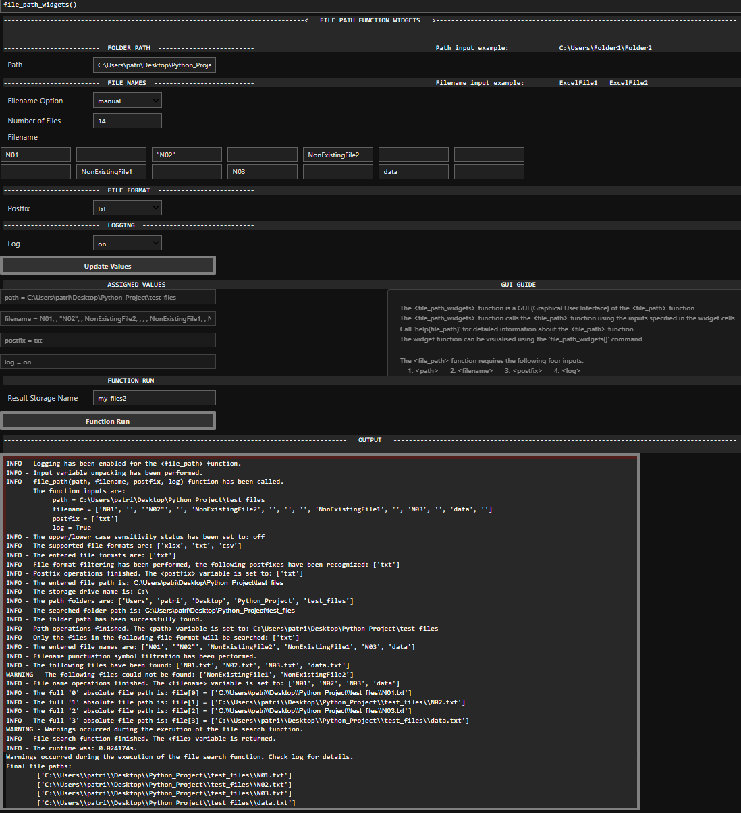

## Table of Contents
1. [Project Overview](#Project-Overview)
2. [Requirements](#Requirements)
3. [Features](#Features)
4. [Usage](#Usage)

## 1. Project Overview
This project provides a set of Python utilities designed to format, filter, and simplify the creation of file paths and the data loading process. It includes a robust function for generating a formated list of absolute file paths with many features, like searching for all files with a specified format in folders. It then stores the results in a variable which can be dirrectly passed into a `pandas.read` function. It suppports `.xlsx`, `.txt` as well as `.csv` formats. It also includes a GUI wrapper which significantly simplifies and further speeds up the file path creation process. The function returns a detailed log which allows the user to quickly check and spot any potential mistakes. Additionally another compatible function using the pandas library to load the content of the stored variables is currently in progress and can be located in the package directory together with all the other functions.

## 2. Requirements
The code is written and contains widgets that are primarily designed for use in `Jupyter Notebook`. However, there is also an alternative, well-documented way to call the functions without the use of widgets, allowing execution in any other Python environment.
The required libraries are: `time`, `numpy`, `pandas`, `re`, `logging`, `os`, `copy`
**Note:** the display of the widgets may vary depending on the `Jupyter Notebook` version and settings.

## 3. Features
### File Path Function (`file_path`)
* **Absolute Path Creation**: Constructs absolute paths to data files based on specified folder paths, filenames, and file formats.
* **Flexible Filename Handling**: Supports searching for specific files or loading all files of a given format within a directory.
    * Example: `filename = ['N04', 'N05', 'N03']` or `filename = ['load all']`.
* **Supported File Formats**: Supports `.xlsx`, `.txt`, and `.csv` files.
* **Logging**: Includes a comprehensive logging feature to provide detailed information about the function's execution and any warnings or errors.
* **Error Handling**: Comprehensive error handling for incorrect inputs (e.g., invalid paths, not found files, etc.).
* **Cross-Platform Path Compatibility**: Automatically adjusts the correct path separator (`/` for Linux/macOS, `\` for Windows) using `os.sep`, ensuring compatibility across different operating systems.
* **Input Filtration**: Filters out unsupported symbols such as `/\:*?"<>|` from the file names.
* **List Unpacking**: Contains features for unpacking nested lists and tuples in the input variables.

### File Path Widget Function (`file_path_widgets`)
* **Graphical User Interface (GUI)**: Provides an interactive easy-to-follow GUI for the `file_path` function, making it easier to define inputs without direct code modification.
* **Dynamic Filename Input**: Allows dynamic adjustment of the number of filename input fields based on user selection (`load all` or `manual`).
* **Real-time Value Display**: Displays the currently assigned input values for `path`, `filename`, `postfix`.
* **Integrated Logging Window**: Features an output window that displays all informational messages, warnings, and errors generated during the `file_path` function execution, allowing for immediate feedback and troubleshooting.
* **Simplified Workflow**: Significantly simplifies and further speeds up the file path creation process.

## 4. Usage
This section provides instructions and examples on how to use the `file_path` and `file_path_widgets` functions.

### 4.1 Using the `file_path` function (code only execution without build-in widgets)
The `file_path` function can be called directly in any Python environment. It offers precise control over file path generation.
### Function Signature:
`file_path(path, filename, postfix, log)`
* `path`: A string representing the full absolute folder path where the files are located.
   * Example: `path = r'C:\Users\YourUser\Documents\Data'`
* `filename`: A list of strings specifying the names of the files to find.
   * Example: `filename = ['filename1', 'filename2']`
   * Alternatively, use `filename = ['load all']` to find all files with the specified postfix within the given path.
* `postfix`: A list containing a single string representing the file extension (e.g., `['xlsx']`, `['txt']`, `['csv']`).
* `log`: A boolean value (True or False) to enable or disable detailed logging of the function's execution. 
 For more detailed guide about the function, call `help(file_path)`.

### Function Execution Examples:
`path = r'C:\Users\username\Desktop\Python_Project'` 
`filename = 'N02', 'N03', 'N04', 'N05'` 
`postfix = 'xlsx'` 
`log = True` 
`file = file_path(path, filename, postfix, log)` 

`path = r'C:\Users\username\Desktop\Python_Project'` 
`filename = 'load all'` 
`postfix = '.txt'` 
`log = False` 
`file = file_path(path, filename, postfix, log)` 

### 4.2 Using the `file_path_widgets` function (Preffered variation, Jupyter Notebook only)
The `file_path_widgets` function provides an interactive graphical user interface (GUI) within `Jupyter Notebook` for easier and faster input definition and execution of the `file_path` function. Call `file_path_widgets()` to run the GUI. Upon execution, the following set of interactive widgets will appear. 

* `Path` text box: Enter the directory path where the files you want to load are located. 
   * Example input: `C:\Users\Folder1\Folder2` 
* `Filename Option`: Select either `load all` (to find all files with the specified `postfix`) or `manual` (to specify individual file names). If `manual` is selected, the `Number of Files` spinner will become active, allowing you to dynamically add `Filename` input fields.
   * `Filename`: Enter the names of your files in the provided text boxes (e.g., `name_of_file1`) 
* `Postfix`: Select the file extension from the dropdown menu (`xlsx`, `txt`, `csv`). 
* `Log`: Choose `on` or `off` to enable or disable logging and function feedback. 
* `Update Values` button: Click the button after the definition of the aforementioned inputs. This action transfers your widget inputs to the internal variables that the `file_path` function will use. The assigned values will be displayed in the **"ASSIGNED VALUES"** section. 
* `Result Storage Name`: Enter the name of the Python variable where the list of generated file paths will be stored (e.g. `my_files`). 
* `Function Run Button`: Click this button to execute the `file_path` function with the specified inputs. The output, including any logs, warnings, or errors, will appear in the **"OUTPUT"** window below the widgets. 
* **Note:** Ensure all input fields are defined and the **"Update Values"** button is clicked before running the function. The display and behavior of widgets may vary slightly based on your `Jupyter Notebook` environment configuration. 
For more detailed guide about the function, call `help(file_path_widgets)`.

### Widget function example 2:

### Widget function example 3:

The outputs are stored in the variable specified in the **Result Storage Name** (`my_files`) in this case. This list serves as an input to pandas.read function.
